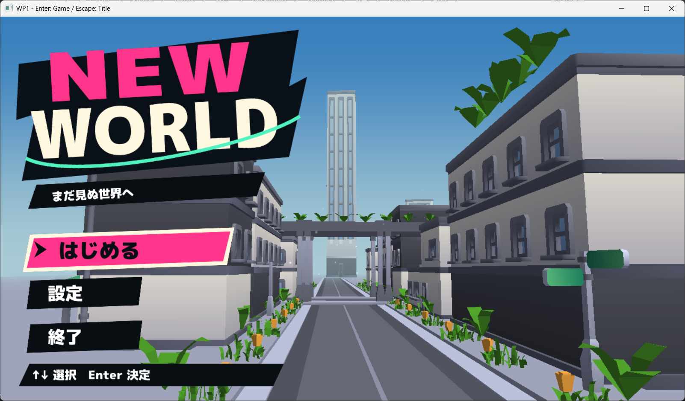

# タイトル画面の制作仕様と実装計画

## 探索体験を伝える改修計画

策定日：2026-09-30。改修開始時のHEAD：2760e14（タイトルBGMと操作効果音を追加）。初期12段階は機能実装の区切りであり、見た目・伝達力の完成を意味しない。今回は街の構図と見せ場を改修する。

### 目的と固定条件

ユーザーが選んだ主な遊びは「街を探索し、秘密や行き先を発見する」。タイトルを見た人が、街へ入り、気になる場所へ寄り道する体験を想像できるようにする。

採用する構図の方向は「街角から、寄り道できる路地と遠くの目印が見えるタイトル」。キャラクターを追加せず、近景から遠景までCC0モデルで制作する。AI背景画像は使わない。既存素材の再配置を先に行い、新しい素材は必要性を確認してから採用・出典記録する。

保持する要素：左側のロゴとメニュー、ピンクの選択色、文字と選択状態の読みやすさ、街の奥行き。既存のキーボード・パッド操作、設定と保存、開始・終了、再訪時の登場省略、背景演出OFF、音量設定を維持する。

ゲーム本編の制作はこの改修に含めない。塔の用途、店名、地域名、共通記号の意味は未確定。タイトルで示す探索先・手掛かりは、本編の方向と整合するものとして検討する。実装されていない仕組みや到達できない場所を、遊べる機能として説明しない。NEW WORLDは引き続き仮題。

### 改修前の比較資料

TitleScreenBaseline.pngは、本会話でユーザーが「スカスカに感じる」と指摘した添付画像を無編集で保存したもの。今回新たに撮影した実機画像ではない。撮影時刻・対応コミットは未確認のため、2760e14の厳密な描画結果とは扱わない。以前のTitleScreenReference.pngは初期の構図検討用AI画像として別に保持する。

画像からの評価（測定結果ではなく設計上の仮説）：

| 現状 | 改修で確かめること |
|---|---|
| 中央の一本道と大きな路面が続く | 街角・分岐に変えると寄り道を想像できるか |
| 窓・建物色・植物の反復が目立つ | 用途の違う場所と密度の差で街らしさを出せるか |
| 遠景の塔が細く淡い | 輪郭と位置で、縮小しても指せる目印になるか |
| 右の建物が大きいが見せ場が少ない | 店先・路地の入口を置くと面積に見合う情報が生まれるか |
| 屋上の植物が浮いたように見える箇所がある | 配置・スケール・光を分けて接地を確認できるか |
| 強いロゴに対して街の個性が弱い | 背景に見せ場を作り、UIと色・記号を共有できるか |

空と道路の余白は残す。画面を小物で均等に埋めることや、モデル数を増やすこと自体を完了条件にしない。

### 見せ場の役割

| 層 | 役割 | 配置方針 |
|---|---|---|
| 前景 | 街をのぞき込む入口 | 画面端に看板や植生のまとまりを置く。UIや経路を隠さない |
| 中景 | 場所の個性 | 特徴のある店先を一つ作り、用途が読み取れる入口にする |
| 寄り道 | 秘密の予感 | 路地の奥を部分的に見せる。全て見通せる通路にも完全な黒い穴にもしない |
| 遠景 | 行きたい目印 | 塔など一つを主役にする。周囲との輪郭・高さ・色の差を調整する |
| UI | 操作と作品の個性 | 左側のまとまりを維持し、目印・路地と競合しないサイズへ調整する |

目指す視線の流れはロゴ、特徴的な入口、遠方の目印、気になる路地。これは配置の仮説であり、全員が同じ順序で見るとは想定しない。ピンクは操作の強調、ミントは街とUIをつなぐ小さな記号の候補とする。

コピーの第一候補は「曲がり角の先に、まだ知らない街がある。」。採用は段階10で構図・本編の方向との一致を確認して決める。

### コミット単位の改修順序

1コミットは一つの変更を見て判断できる状態とする。ユーザーの「次」ごとに原則1段階を進める。必要なソース・素材・プロジェクト登録・出典・検証を同じ区切りに含める。

| 段階 | 内容と完了条件 | コミットメッセージ案 |
|---|---|---|
| 1 | 目的・比較画像・残す要素・確認条件を記録する | タイトル画面の探索体験を伝える改修仕様を追加 |
| 2 | 既存モデルとカメラを組み直し、小物に頼らず街角と脇道の関係が読める | タイトル背景を街角と路地が見える構図に変更 |
| 3 | 遠方の目印の輪郭・高さ・位置を整え、縮小表示でも指せる | タイトル背景の探索先となる目印を整備 |
| 4 | 路地の入口と部分的に見える奥を整え、近くに寄り道したい場所を作る | タイトル背景に寄り道を予感させる路地を追加 |
| 5 | ロゴとメニューの配置を調整し、目印・路地の見せ場と両立する | 探索先を見せるタイトルUI配置に調整 |
| 6 | 一つの店先に看板・入口・庇などを集め、用途を説明できる場所を作る | タイトル背景に特徴的な店先を追加 |
| 7 | 配置理由を記録した案内・共通記号で、場所の関係を予感させる | 街の探索につながる案内と手掛かりを追加 |
| 8 | 植生を群落として配置し、等間隔の反復・不自然なサイズ・浮いた接地を修正する | タイトル背景の植生配置と接地感を改善 |
| 9 | 店先・路地・目印の明暗、壁面の単調さ、遠景の霞を調整する | 探索先を引き立てるタイトル背景の照明を調整 |
| 10 | 色・記号・探索を伝えるコピーを街とUIで統一する | 街の探索テーマに合わせてタイトル意匠を統一 |
| 11 | 新構図へカメラ移動・光の粒・BGMを合わせ、見せ場と操作を邪魔しないようにする | タイトルの待機演出と音のバランスを調整 |
| 12 | 各画面サイズ・設定・開始終了・再訪・実パッド・初見での伝達を確認し修正する | タイトル画面の最終調整と動作確認を実施 |

段階2は道・建物・カメラの大きな構成、段階4は路地内の見通しと入口の調整に分ける。照明にエンジンの影などの基盤変更が必要になった場合は、必要性を確認した上で独立したコミットを挟む。影の実装は現時点の確定作業ではない。

### 確認地点と比較方法

段階2で構図を確認し、段階5で前半の方向性を判断する。目印と寄り道が弱い場合は構図へ戻し、細部の追加で解決したことにしない。段階9で静止画の見え方、段階12で操作・動き・音を含む全体を確認する。

- 1280×720を基準とし、1024×768と720×1280でもUIの欠け・背景の見せ場との重なりを確認する。
- 同条件の比較では背景演出OFFで再起動し、基準視点・登場完了・「はじめる」選択で撮影する。OFF切り替えだけでは途中の視点で停止するため比較条件が揃わない。
- 画像にはビルド構成・コミットまたは未コミット差分・描画サイズ・設定・確認内容を添える。途中の検証画像はgenerated以下、採用する比較資料はdocs以下に置く。
- 縮小した画面でも目的地を指せるか、背景だけでも探索の入口に見えるかを確認する。縮小比は比較時に揃える。実装済みのUI非表示機能があるとは扱わない。
- 初見の確認では説明前に画面を短時間見せ、「どんなゲームだと思うか」「どこへ行きたいか」「何が気になるか」を自由回答で聞く。回答を誘導せず、実施人数と回答を記録する。まだ実施していない。
- 目標は「街を探索する」と解釈でき、近い寄り道と遠い目印を挙げられ、開始操作に迷わないこと。統計的に検証した基準や一律の成功率ではなく、改修判断の目安とする。
- 自動描画テストはGPUエラー等の確認であり、見た目・楽しさ・聴感の確認とは分けて報告する。
- 共通コード・プロジェクト変更では3構成のビルドを確認する。入力・保存・演出を変更した段階では該当する回帰テストを実行する。文書だけの変更ではビルドしない。

前段階から実機確認の一部が未完了。設定の実操作、開始・終了と再訪、実コントローラー、音量の聴感確認は段階12の対象として残す。Computer Useがユーザー操作で停止された場合は、その時点までの確認と未確認項目を分ける。

### 調査から採用する考え方

以下は前の調査で確認した資料。資料の主張と、この画面への応用は区別する。具体的な配置やコピーは本計画の提案であり、出典で実証された唯一の正解ではない。

| 資料 | 確認した内容と今回への応用 |
|---|---|
| [Mobius Digital：The Intentionality of Wandering](https://www.mobiusdigitalgames.com/news/the-intentionality-of-wandering) | 行き先を予感させ、好奇心で選ぶ経路設計。路地と遠景の目印へ応用 |
| [ファミ通：ペルソナ5 UI制作講演の取材](https://www.famitsu.com/news/201711/13145540.html) | 作品の個性と情報伝達を両立し、色・ロゴ・フォントを関連付ける。街とUIの共通意匠へ応用 |
| [任天堂：Kirby and the Forgotten Land開発者インタビュー](https://www.nintendo.com/au/news-and-articles/ask-the-developer-vol-4-kirby-and-the-forgotten-land/) | 青空・植物・看板から、かつて暮らしのあった世界を感じさせる。キャラクターは採用せず街の痕跡へ応用 |
| [Valve：Illustrative Rendering in Team Fortress 2](https://steamcdn-a.akamaihd.net/apps/valve/2007/NPAR07_IllustrativeRenderingInTeamFortress2.pdf) | 過剰な細部や反復を抑え、形と色を読みやすくする。密度を均一に増やさない配置へ応用 |
| [Frictional Games：Storytelling through fragments and situations](https://frictionalgames.com/2010-03-storytelling-through-fragments-and-situations/) | 環境や音も物語の断片になる。小物の配置に意味を持たせる |
| [Xbox Accessibility Guideline 102](https://learn.microsoft.com/en-us/gaming/accessibility/xbox-accessibility-guidelines/102)・[117](https://learn.microsoft.com/en-us/xbox/accessibility/xbox-accessibility-guidelines/117) | 文字のコントラストと動きの停止手段。読みやすさと演出OFFを維持する |

素材の採用記録は[TitleScreenAssets.md](TitleScreenAssets.md)へ追記する。調査で見つけただけの素材を採用済みとは記載しない。

### この段階の状態

改修段階1の文書と比較画像を追加。段階2～12は未着手。ゲームコード・実行用素材・音声の変更はない。

---

## 初期制作計画（履歴）

作成日：2026-09-29

## 制作方針

キャラクターなしの「街の景色＋UI」を制作する。2026-09-30 の方針変更により、近景・中景・遠景・植物・装飾を CC0 モデルと付属素材で制作する。AI 画像はゲーム内に使用しない。左側の大胆なロゴとメニュー、右側の緑に覆われた街、中央奥の塔と青空を軸にする。

以下は初期制作時の仕様・履歴。現在の改修では本書冒頭の「探索体験を伝える改修計画」を優先し、矛盾しない素材・操作の条件を引き継ぐ。TitleScreenResearch.md は参考作品を調べた時点の記録であり、主人公や画像だけで構成する案など、本書と異なる提案は採用しない。

基準画像：[キャラクターを除いたタイトル案](TitleScreenReference.png)。完成像の参考として保存し、そのまま一枚の操作画面にはしない。NEW WORLD と「まだ見ぬ世界へ」は仮の表記。

## 出発点

- 確認時の HEAD は 1422d97。TitleScene は Title.png をスプライトで表示し、Enter で Game に遷移する。Release でも描画される。
- 既存のモデル・テクスチャ共有、カメラ、スプライト、音声、キーボード・ゲームパッド機能を活用する。
- タイトル用の街、メニュー選択、設定保存、登場演出はこれから追加する。
- 実装済みの機能と素材互換性は区別する。CC0 モデルの実機表示で必要な拡張を判断する。

## 画面と素材の分担

| 部分 | 制作方法 | 注意点 |
|---|---|---|
| 建物・道路・橋・手すり・看板本体 | CC0 の静的モデル | 単位、向き、材質、色をそろえる |
| 遠方の塔・遠景の街・雲 | CC0 モデル | 近景と同じ3D空間へ配置。空色は描画処理で表現する |
| 植物 | 近景・遠景とも CC0 モデル | 透過と両面表示の互換性を確認する |
| 看板の絵・汚れ・装飾 | CC0 モデルと付属テクスチャ | 読ませる文字は別に組む |
| ロゴ・帯・矢印・装飾 | 個別の 2D 素材 | 選択状態や移動を独立して制御する |
| メニュー文字・操作案内 | フォントまたはフォントから生成した文字画像 | AI 画像に焼き込まず、使用フォントの出典を記録する |

構図は 16:9 を基準とし、初期実装の配置基準は 1280×720 とする。異なる画面サイズでは縦横比を維持し、UI が切れないようにする。左上にロゴ、左下に「はじめる／設定／終了」、最下部に操作案内を置く。選択はピンクの帯と矢印で示す。

近景と遠景は同じ3D空間で描画し、建物・植物・遠景の霞で奥行きを調整する。カメラは固定を基準に、小さな移動だけを許す。画像の精細さをそのまま再現できるとは想定せず、まず構図と色の一致を確認する。

## 操作と状態

- メニューに入った時点で「はじめる」を選択する。上下で選択、決定で実行する。
- キーボードとゲームパッドに対応し、表示する案内も使用中の入力に合わせる。
- 同じ決定入力が、登場演出のスキップとゲーム開始の両方に使われないようにする。
- 「はじめる」は既存 Game シーンに遷移する。ゲーム本編の制作は本計画の対象外。
- 設定には音量と背景演出の有効・無効を用意する。保存先はユーザーの書き込み可能領域とし、欠損・不正値では既定値を使う。
- 終了はアプリの通常の終了経路を使い、リソースを解放する。
- 演出中も入力の反応を分かるようにし、再訪時には長い登場演出を繰り返さない。

## 素材の記録と保存

実際に採用する素材だけを App/Assets 以下の既存分類へ追加する。素材がない段階では空フォルダーを増やさない。取得した ZIP や不採用候補、検証画像は generated 以下に置き、Git に含めない。

採用時に docs/TitleScreenAssets.md を作り、素材ごとに次を記録する。

| 種類 | 記録する情報 |
|---|---|
| CC0 モデルと付属画像 | 素材名、作者、配布ページ、ダウンロード元、取得日、配布元の CC0 表示の確認先、同梱ライセンスの保存先、採用ファイル、変換・編集内容 |
| 検討用の AI 画像 | 構図の参考資料に限定。ゲーム内素材としては採用しない |
| フォント・音声 | 素材名、作者・配布元、取得日、利用条件の確認先、同梱ライセンス、採用ファイル |

検討用 AI 画像を CC0 素材として記録しない。モデルの付属テクスチャも配布条件を確認する。未確認の候補は採用済みと記載しない。ランタイム用ファイルはリポジトリに含め、作者の PC 固有パスやネット接続に依存させない。モデル変換が必要な場合は入力・出力形式と再現手順を残す。

## コミットごとの完了条件

1 コミットは「一つの機能が使える状態」を単位とする。ソース、プロジェクト登録、必要素材、出典、検証を同じ単位に含める。ファイル数や行数だけでは分割しない。

| 順番 | コミットメッセージ案 | 完了条件 |
|---|---|---|
| 1 | タイトル画面の制作仕様と素材管理方針を追加 | 基準画像、素材分担、操作、分割方針を保存する |
| 2 | タイトル用CC0モデルの読み込みと表示に対応 | モデル1点をタイトルに表示し、材質・向き・スケールを確認する。出典を保存する |
| 3 | タイトル背景の街並みと固定カメラを追加 | 建物・道路・橋で基準画像に近い構図を作る |
| 4 | CC0モデルによる遠景の街並みを追加 | 遠方の建物と高層の目印を3Dで配置し、通りとの重なりを確認する |
| 5 | タイトル背景の植生と看板装飾を追加 | 手前の緑と看板を加え、透過部分を確認する |
| 6 | タイトル背景の色調と奥行き表現を調整 | 素材の色調と遠景の見え方をそろえる |
| 7 | タイトルロゴとメニューの描画を追加 | ロゴ・文字・帯・案内を独立描画し、画面サイズ変更で欠けない |
| 8 | タイトルメニューの選択と開始・終了操作を追加 | キーボードとゲームパッドで選択・開始・終了できる。二重決定を防ぐ |
| 9 | タイトル設定画面と設定保存を追加 | 音量・背景演出を変更・保存でき、再起動後も反映される |
| 10 | タイトルの登場・選択・画面遷移演出を追加 | 登場・選択・開始に演出を付け、再訪とスキップを確認する |
| 11 | タイトル背景の待機演出を追加 | 小さなカメラ移動や光の粒が動き、設定で停止できる |
| 12 | タイトルBGMと操作効果音を追加 | BGM・選択音・決定音が鳴り、音量設定とシーン離脱を正しく扱う |

2 番でモデル互換性を確認し、透過や材質などの共通機能が不足している場合は、その機能を独立したコミットとして挟む。不要な基盤拡張は行わない。8 番まで設定項目は未接続とし、実行可能な機能として見せない。9 番では既存の音声機能で音量反映を確認し、12 番でタイトル用音源へ適用する。

最初の構図の確認地点は 4 番。ここで視点・ロゴ予定領域・遠景の建物との重なりを見てから細部へ進む。段階 6・12 でも基準画像と実機を比較する。

## 検証と履歴

- 各段階で表示または操作を実機確認する。素材欠損で初期化に失敗した際の診断も確認する。
- 共通コード・プロジェクト設定を変更した段階では、CONTRIBUTING.md に従い Debug・Development・Release をビルドする。
- 入力・保存などには必要な動作検証を行い、見た目の調整だけに実装をなぞるテストを追加しない。
- 画面確認は基準サイズに加えてサイズ変更時も行い、ロゴ・文字の欠け、選択状態、背景の継ぎ目を見る。
- 完了報告には変更点、実際に行った確認、残る制限、一行のコミットメッセージを記載する。
- コミットは検証済みの区切りで作成し、既存の無関係な変更を含めない。リモートへの push は本計画に含めない。

## 基準画像の記録

TitleScreenReference.png は本会話で生成した検討用画像。2026-09-29 に既存案から大きなピンクのキャラクターと小さなマスコットを除き、UI と街の景色を残す編集で生成した。ゲームに読み込む完成素材ではなく、構図と色の参照資料として保存する。
